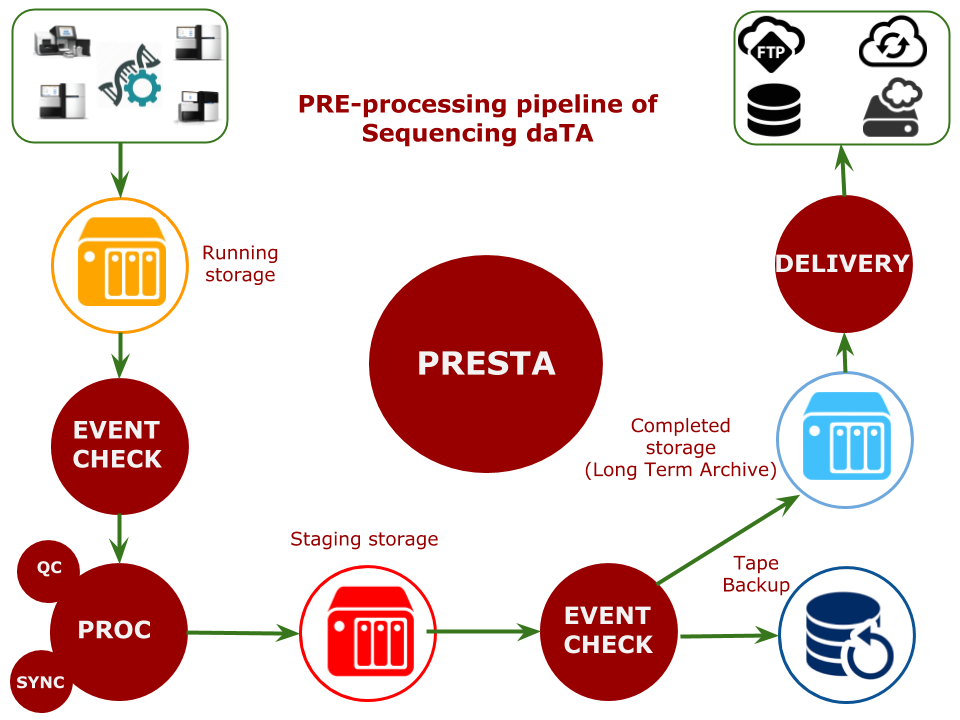

# presta
PRE-processing of Sequencing daTA  

Presta handles sequencing data produced  from a large scale NGS Core facility.
It leverages a reliable distributed task queue to create a messages-driven 
automation system. Presta is  focused on real-time operation, but supports 
scheduling as well.

Presta is part of a fully automated infrastructure to support bioinformatics analysis 
of sequencing data.

Tasks currently supported:  

- Monitoring of the state of an Illumina rundir
- Illumina bcl2fastq software execution at the end of the sequencer's run
- Production of a detailed quality report on sequencing data coming from the previous step 
- Updating the activities details on the LIMS portal
- Data delivery to a remote  FTP folder, to an iRODS collection, to a local/remote filesystem path or to a removable device.
- Querying the LIMS portal to retrieve details about the data produced

 
## Requirements:

- Python 2.7
- [alta](https://github.com/gmauro/alta)
- [ansible](https://www.ansible.com)
- [appdirs](https://github.com/activestate/appdirs)
- [celery](http://www.celeryproject.org/)
- [comoda](https://github.com/gmauro/comoda)
- [drmaa](https://github.com/pygridtools/drmaa-python)
